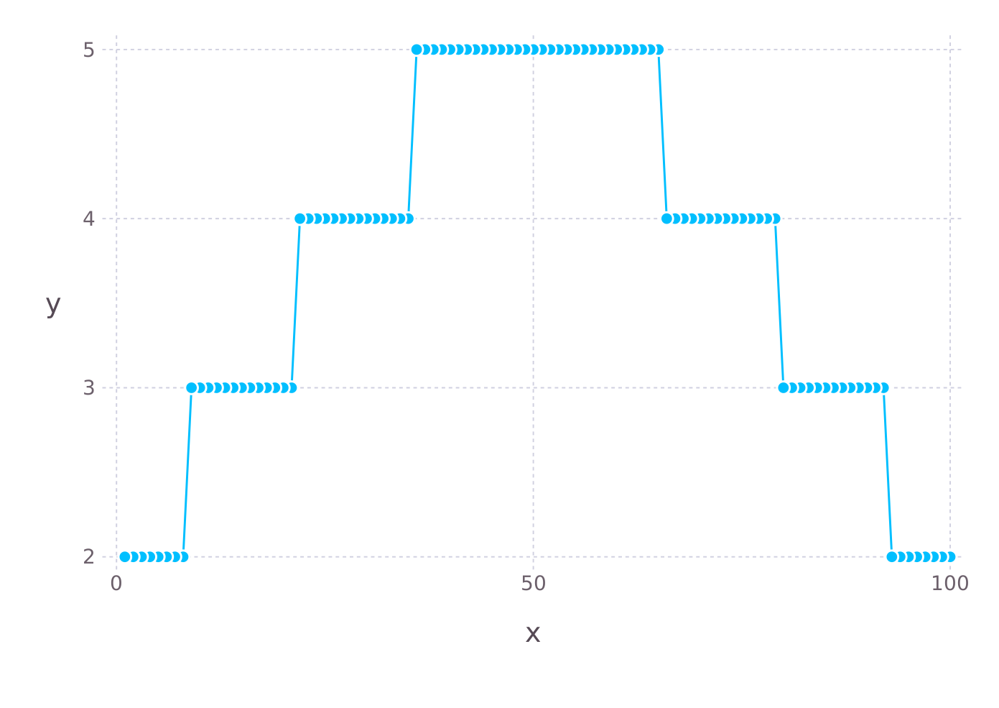
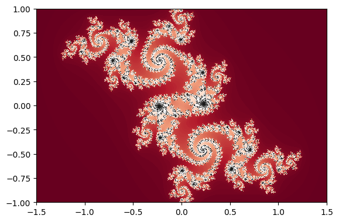

<a href="https://github.com/ipython-books/cookbook-2nd"></a> *This is one of the 100+ free recipes of the [IPython Cookbook, Second Edition](https://github.com/ipython-books/cookbook-2nd), by [Cyrille Rossant](http://cyrille.rossant.net), a guide to numerical computing and data science in the Jupyter Notebook. The ebook and printed book are available for purchase at [Packt Publishing](https://www.packtpub.com/big-data-and-business-intelligence/ipython-interactive-computing-and-visualization-cookbook-second-e).*

▶ *[Text on GitHub](https://github.com/ipython-books/cookbook-2nd) with a [CC-BY-NC-ND license](https://creativecommons.org/licenses/by-nc-nd/3.0/us/legalcode)*  
▶ *[Code on GitHub](https://github.com/ipython-books/cookbook-2nd-code) with a [MIT license](https://opensource.org/licenses/MIT)*

[*Chapter 5 : High-Performance Computing*](./)

# 5.12. Trying the Julia programming language in the Jupyter Notebook

**Julia** (http://julialang.org) is a high-level, dynamic language for high-performance numerical computing. The first version was released in 2012 after three years of development at MIT. Julia borrows ideas from Python, R, MATLAB, Ruby, Lisp, C, and other languages. Its major strength is to combine the expressivity and ease of use of high-level, dynamic languages with the speed of C (almost). This is achieved via an LLVM-based Just-In- Time (JIT) compiler that targets machine code for x86-64 architectures.

In this recipe, we will try Julia in the Jupyter Notebook using the **IJulia** package available at https://github.com/JuliaLang/IJulia.jl. We will also show how to use Python packages (such as NumPy and matplotlib) from Julia. Specifically, we will compute and display a Julia set.

This recipe is inspired by a Julia tutorial given by David P. Sanders at the SciPy 2014 conference, available at http://nbviewer.ipython.org/github/dpsanders/scipy_2014_julia/tree/master/

## Getting ready

You first need to install Julia. You will find packages for Windows, macOS, and Linux on Julia's website at http://julialang.org/downloads/.

Open a Julia terminal with the `julia` command, and install IJulia by typing `Pkg.add("IJulia")` in the Julia terminal. Then, quit Julia with `exit()` and launch the Jupyter Notebook as usual with `jupyter notebook`. The IJulia kernel is now available in Jupyter.

## How to do it...

1. We can't avoid the customary *Hello World* example. The `println()` function displays a string and adds a line break at the end:

```julia
println("Hello world!")
```

```{output:stdout}
Hello world!
```

2. We create a polymorphic function, `f`, that computes the expression `z*z+c`. We will evaluate this function on arrays, so we use element-wise operators with a dot (`.`) prefix:

```julia
f(z, c) = z.*z .+ c
```

```{output:result}
f (generic function with 1 method)
```

3. Let's evaluate `f` on scalar complex numbers (the imaginary number $i$ is `1im`).

```julia
f(2.0 + 1.0im, 1.0)
```

```{output:result}
4.0 + 4.0im
```

4. Now, we create a `(2, 2)` matrix. Components are separated by a space and rows are separated by a semicolon (`;`). The type of this `Array` is automatically inferred from its components. The `Array` type is a built-in data type in Julia, similar, but not identical, to NumPy's `ndarray` type:

```julia
z = [-1.0 - 1.0im  1.0 - 1.0im;
     -1.0 + 1.0im  1.0 + 1.0im]
```

```{output:result}
2×2 Array{Complex{Float64},2}:
 -1.0-1.0im  1.0-1.0im
 -1.0+1.0im  1.0+1.0im
```

5. We can index arrays with brackets `[]`. A notable difference with Python is that indexing starts from 1 instead of 0. MATLAB has the same convention. Furthermore, the keyword `end` refers to the last item in that dimension:

```julia
z[1,end]
```

```{output:result}
1.0 - 1.0im
```

6. We can evaluate `f` on the matrix `z` and a scalar `c` (polymorphism):

```julia
f(z, 0)
```

```{output:result}
2×2 Array{Complex{Float64},2}:
 0.0+2.0im  0.0-2.0im
 0.0-2.0im  0.0+2.0im
```

7. Now, we create a function, `julia`, that computes a Julia set. Optional named arguments are separated from positional arguments by a semicolon (`;`). Julia's syntax for flow control is close to that of Python's, except that colons are dropped, indentation doesn't count, and block `end` keywords are mandatory:

```julia
function julia(z, c; maxiter=200)
    for n = 1:maxiter
        if abs2(z) > 4.0
            return n-1
        end
        z = f(z, c)
    end
    return maxiter
end
```

```{output:result}
julia (generic function with 1 method)
```

8. We can use Python packages from Julia. First, we have to install the `PyCall` package by using Julia's built-in package manager (`Pkg`). Once the package is installed, we can use it in the interactive session with using `PyCall`:

```julia
Pkg.add("PyCall")
using PyCall
```

9. We can import Python packages with the `@pyimport` macro (a metaprogramming feature in Julia). This macro is the equivalent of Python's `import` command:

```julia
@pyimport numpy as np
```

10. The `np` namespace is now available in the Julia interactive session. NumPy arrays are automatically converted to Julia `Array` objects:

```julia
z = np.linspace(-1., 1., 100)
```

```{output:result}
100-element Array{Float64,1}:
 -1.0
 -0.979798
 -0.959596
  ⋮
  0.959596
  0.979798
  1.0
```

11. We can use list comprehensions to evaluate the function `julia` on many arguments:

```julia
m = [julia(z[i], 0.5) for i=1:100]
```

```{output:result}
100-element Array{Int64,1}:
 2
 2
 ⋮
 2
 2
```

12. Let's try the Gadfly plotting package. This library offers a high-level plotting interface inspired by Dr. Leland Wilkinson's textbook The Grammar of Graphics. In the Notebook, plots are interactive thanks to the **D3.js** library:

```julia
Pkg.add("Gadfly")
using Gadfly
```

```julia
plot(x=1:100, y=m, Geom.point, Geom.line)
```



13. Now, we compute a Julia set by using two nested loops. In general, and unlike Python, there is no significant performance penalty in using `for` loops instead of vectorized operations. High-performance code can be written either with vectorized operations or `for` loops:

```julia
@time m = [julia(complex(r, i), complex(-0.06, 0.67))
           for i = 1:-.001:-1,
               r = -1.5:.001:1.5];
```

```{output:stdout}
  1.99 seconds (12.1 M allocations: 415.8 MiB)
```

14. Finally, we use the `PyPlot` package to draw matplotlib figures in Julia:

```julia
Pkg.add("PyPlot")
using PyPlot
```

```julia
imshow(m, cmap="RdGy",
       extent=[-1.5, 1.5, -1, 1]);
```



## How it works...

Languages used to be either low-level, difficult to use, but fast (such as C); or high-level, easy to use, but slow (such as Python). In Python, solutions to this problem include NumPy and Cython, among others.

Julia developers chose to create a new high-level but fast language, bringing the best of both worlds together. This is essentially achieved through Just-In-Time compilation techniques implemented with LLVM.

Julia dynamically parses code and generates low-level code in the LLVM Intermediate Representation. This representation features a language-independent instruction set that is then compiled to machine code. Code written with explicit loops is directly compiled to machine code. This explains why the performance-motivated vectorization of code is generally not required with Julia.

## There's more...

Strengths of Julia include:

* A powerful and flexible dynamic type system based on multiple dispatch for parametric polymorphism
* Facilities for metaprogramming
* A simple interface for calling C, FORTRAN, or Python code from Julia
* Built-in support for fine-grained parallel and distributed computing
* A built-in multidimensional array data type and numerical computing library
* A built-in package manager based on Git
* External packages for data analysis such as DataFrames (equivalent of pandas) and Gadfly (statistical plotting library)
* Integration in the Jupyter Notebook

The main strengths of Python against Julia are its wide community, ecosystem, and the fact that it is a general-purpose language. It is easy to bring numerical computing code written in Python to a Python-based production environment.

Fortunately, one may not have to choose because both Python and Julia can be used in the Jupyter Notebook, and there are ways to make both languages talk to each other via **PyCall** and **pyjulia**.

We have only scratched the surface of the Julia language in this recipe. Topics of interest we couldn't cover in details here include Julia's type system, the metaprogramming features, the support for parallel computing, and the package manager, among others.

Here are some references:

* The Julia language on Wikipedia available at https://en.wikipedia.org/wiki/Julia_%28programming_language%29
* Official documentation of Julia available at http://docs.julialang.org/en/latest/
* PyCall.jl for calling Python from Julia available at https://github.com/stevengj/PyCall.jl
* pyjulia for calling Julia from Python available at https://github.com/JuliaPy/pyjulia
* PyPlot.jl for using matplotlib in Julia available at https://github.com/stevengj/PyPlot.jl
* Gadfly.jl, a Julia plotting library, available at http://gadflyjl.org/stable/
* DataFrames.jl, an equivalent of pandas for Julia, available at https://github.com/JuliaStats/DataFrames.jl
* Juno, an IDE for Julia, available at http://junolab.org/
