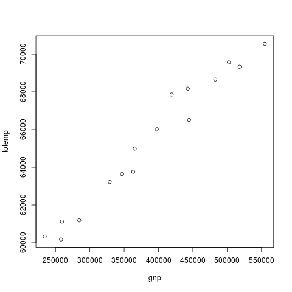
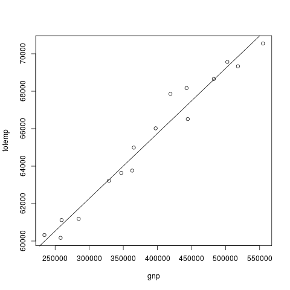

<a href="https://github.com/ipython-books/cookbook-2nd"></a> *This is one of the 100+ free recipes of the [IPython Cookbook, Second Edition](https://github.com/ipython-books/cookbook-2nd), by [Cyrille Rossant](http://cyrille.rossant.net), a guide to numerical computing and data science in the Jupyter Notebook. The ebook and printed book are available for purchase at [Packt Publishing](https://www.packtpub.com/big-data-and-business-intelligence/ipython-interactive-computing-and-visualization-cookbook-second-e).*

▶ *[Text on GitHub](https://github.com/ipython-books/cookbook-2nd) with a [CC-BY-NC-ND license](https://creativecommons.org/licenses/by-nc-nd/3.0/us/legalcode)*  
▶ *[Code on GitHub](https://github.com/ipython-books/cookbook-2nd-code) with a [MIT license](https://opensource.org/licenses/MIT)*

[*Chapter 7 : Statistical Data Analysis*](./)

# 7.8. Analyzing data with the R programming language in the Jupyter Notebook

**R** (http://www.r-project.org) is an open-source domain-specific programming language for statistics. Its syntax is well-adapted to statistical modeling and data analysis. By contrast, Python's syntax is typically more convenient for general-purpose programming. Luckily, Jupyter allows us to have the best of both worlds. For example, we can insert R code snippets anywhere in a normal Jupyter notebook. We can continue using Python and pandas for data loading and wrangling, and switch to R to design and fit statistical models. Using R instead of Python for these tasks is more than a matter of programming syntax; R comes with an impressive statistical toolbox.

In this recipe, we will show how to interface R with Python in the Jupyter Notebook , and we will illustrate the most basic capabilities of R with a simple data analysis example.

> There is another way of using R in the Jupyter Notebook, which is to install **IR**, the R kernel for Jupyter. Using this method, all of the code of an IR notebook is written in R, not in Python. You will find more information at https://irkernel.github.io/installation/.

## Getting ready

You need the statsmodels package for this recipe. It should be installed by default with Anaconda, but you can always install it with `conda install statsmodels`.

You also need R and rpy2 (https://rpy2.readthedocs.io/). There are three steps to use R with Python:

1. Download R from https://cran.r-project.org/ and install it.
2. Install rpy2 with `conda install rpy2`.
3. Run the `%load_ext rpy2.ipython` command in a Jupyter notebook.

> rpy2 does not appear to work well on Windows. We recommend using Linux or macOS.

## How to do it...

Here, we will use the following workflow: first, we load data from Python. Then, we use R to design and fit a model, and to make some plots in the Jupyter Notebook. We could also use R only for the entire recipe, or Python only. The goal of this recipe is precisely to show how to use both languages in the same Jupyter notebook.

1. Let's load the *longley* dataset with the statsmodels package. This dataset contains a few economic indicators in the US from 1947 to 1962. We also load the IPython R extension:

```python
import statsmodels.datasets as sd
```

```python
data = sd.longley.load_pandas()
```

```python
%load_ext rpy2.ipython
```

2. We define `x` and `y` as the **exogeneous** (independent) and **endogenous** (dependent) variables, respectively. The endogenous variable quantifies the total employment in the country.

```python
data.endog_name, data.exog_name
```

```{output:result}
('TOTEMP', ['GNPDEFL', 'GNP', 'UNEMP',
            'ARMED', 'POP', 'YEAR'])
```

```python
y, x = data.endog, data.exog
```

3. For convenience, we add the endogenous variable to the `x` DataFrame:

```python
x['TOTEMP'] = y
```

```python
x
```


4. We will make a simple plot in R. First, we need to pass Python variables to R. We use the `%R -i var1,var2` magic. Then, we call R's `plot()` command:

```python
gnp = x['GNP']
totemp = x['TOTEMP']
```

```python
%R -i totemp,gnp plot(gnp, totemp)
```



5. Now that the data has been passed to R, we can fit a linear model to the data. In R, the `lm()` function lets us perform a linear regression. Here, we want to express `totemp` (total employment) as a function of the country's GNP. We use the `%%R` cell magic to write several lines of R code in a cell:

```python
%%R
# Least-squares regression
fit <- lm(totemp ~ gnp)
# Display the coefficients of the fit.
print(fit$coefficients)
# Plot the data points.
plot(gnp, totemp)
# And plot the linear regression.
abline(fit)
```



## How it works...

The `-i` and `-o` options of the `%R` magic allow us to pass variables back and forth between IPython and R. The variable names need to be separated by commas. You can find more information about the `%R` magic in the documentation available at https://rpy2.readthedocs.io/.

In R, the tilde (~) expresses the dependence of a dependent variable upon one or several independent variables. The `lm()` function allows us to fit a simple linear regression model to the data. Here, `totemp` is expressed as a function of gnp:

$$\mathrm{totemp} = a \times \mathrm{gnp} + b$$

Here, `b` (intercept) and `a` are the coefficients of the linear regression model. These two values are returned by `fit$coefficients` in R, where `fit` is the fitted model.

Our data points do not satisfy this relation exactly, but the coefficients are chosen so as to minimize the error between this linear prediction and the actual values. This is typically done by minimizing the following least squares error:

$$r(a,b) = \sum_{i=1}^n (\mathrm{totemp}_i - (a \times \mathrm{gnp}_i + b))^2$$

The data points are $(gnp_i, totemp_i)$ here. The coefficients $a$ and $b$ that are returned by `lm()` make this sum minimal: they fit the data best.

## There's more...

Regression is an important statistical concept that we will see in greater detail in the next chapter. Here are a few references:

* Regression analysis on Wikipedia, available at https://en.wikipedia.org/wiki/Regression_analysis
* Least squares method on Wikipedia, available at https://en.wikipedia.org/wiki/Linear_least_squares_%28mathematics%29

Here are a few references about R:

* Introduction to R available at http://cran.r-project.org/doc/manuals/R-intro.html
* R tutorial available at http://www.cyclismo.org/tutorial/R/
* CRAN, or Comprehensive R Archive Network, containing many packages for R, available at http://cran.r-project.org

## See also

* Exploring a dataset with Pandas and matplotlib
