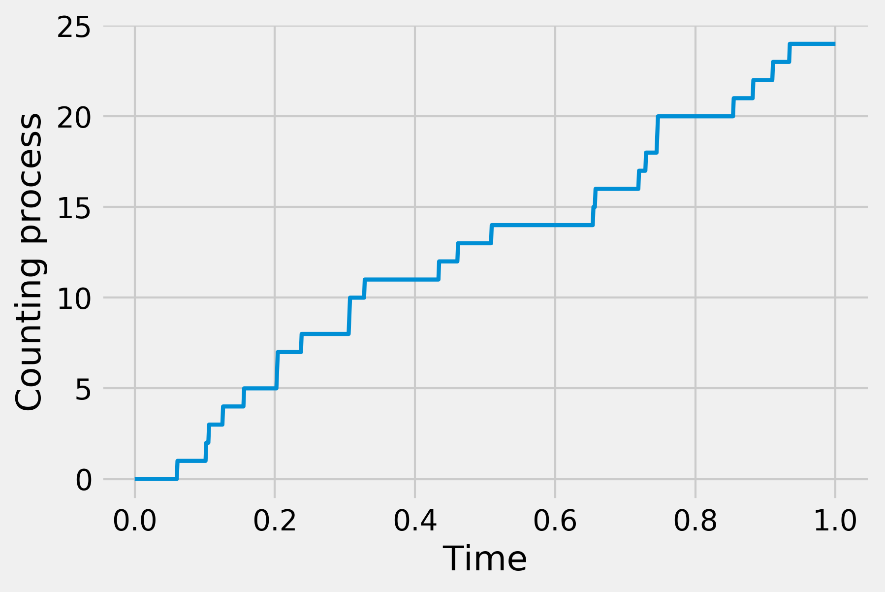

<a href="https://github.com/ipython-books/cookbook-2nd"></a> *This is one of the 100+ free recipes of the [IPython Cookbook, Second Edition](https://github.com/ipython-books/cookbook-2nd), by [Cyrille Rossant](http://cyrille.rossant.net), a guide to numerical computing and data science in the Jupyter Notebook. The ebook and printed book are available for purchase at [Packt Publishing](https://www.packtpub.com/big-data-and-business-intelligence/ipython-interactive-computing-and-visualization-cookbook-second-e).*

▶ *[Text on GitHub](https://github.com/ipython-books/cookbook-2nd) with a [CC-BY-NC-ND license](https://creativecommons.org/licenses/by-nc-nd/3.0/us/legalcode)*  
▶ *[Code on GitHub](https://github.com/ipython-books/cookbook-2nd-code) with a [MIT license](https://opensource.org/licenses/MIT)*

[*Chapter 13 : Stochastic Dynamical Systems*](./)

# 13.2. Simulating a Poisson process

A **Poisson process** is a particular type of **point process**, a stochastic model that represents random occurrences of instantaneous events. Roughly speaking, the Poisson process is the least structured, or the most random, point process.

The Poisson process is a particular continuous-time Markov process.

Point processes, and notably Poisson processes, can model random instantaneous events such as the arrival of clients in a queue or on a server, telephone calls, radioactive disintegrations, action potentials of nerve cells, and many other phenomena.

In this recipe, we will show different methods to simulate a homogeneous stationary Poisson process.

## How to do it...

1. Let's import NumPy and matplotlib:

```python
import numpy as np
import matplotlib.pyplot as plt
%matplotlib inline
```

2. Let's specify the `rate` value, that is, the average number of events per second:

```python
rate = 20.  # average number of events per second
```

3. First, we will simulate the process using small time bins of 1 millisecond:

```python
dt = .001  # time step
n = int(1. / dt)  # number of time steps
```

4. On every time bin, the probability that an event occurs is about `rate * dt` if `dt` is small enough. Besides, as the Poisson process has no memory, the occurrence of an event is independent from one bin to another. Therefore, we can sample Bernoulli random variables (either 1 or 0, respectively representing an experiment's success or failure) in a vectorized way in order to simulate our process:

```python
x = np.zeros(n)
x[np.random.rand(n) <= rate * dt] = 1
```

The `x` vector contains zeros and ones on all time bins, 1 corresponding to the occurrence of an event:

```python
x[:10]
```

```{output:result}
array([ 1.,  0.,  ...,  0.,  0.])
```

5. Let's display the simulated process. We draw a vertical line for each event:

```python
fig, ax = plt.subplots(1, 1, figsize=(6, 2))
ax.vlines(np.nonzero(x)[0], 0, 1)
ax.set_axis_off()
```


6. Another way of representing that same object is by considering the associated **counting process** $N(t)$,which is the number of events that have occurred until time $t$. Here, we can display this process using the `cumsum()` function:

```python
fig, ax = plt.subplots(1, 1, figsize=(6, 4))
ax.plot(np.linspace(0., 1., n),
        np.cumsum(x), lw=2)
ax.set_xlabel("Time")
ax.set_ylabel("Counting process")
```



7. The other (and more efficient) way of simulating the homogeneous Poisson process is to use the property that the time intervals between two successive events follow an exponential distribution. Furthermore, these intervals are independent. Thus, we can sample them in a vectorized way. Finally, we get our process by cumulatively summing all of these intervals:

```python
y = np.cumsum(np.random.exponential(1. / rate,
                                    size=int(rate)))
```

The `y` vector contains another realization of our Poisson process, but the data structure is different. Every component of the vector is an event time:

```python
y[:10]
```

```{output:result}
array([ 0.021,  0.072,  0.087,  0.189,  0.224,
        0.365,  0.382,  0.392,  0.458,  0.489])
```

8. Finally, let's display the simulated process:

```python
fig, ax = plt.subplots(1, 1, figsize=(8, 3))
ax.vlines(y, 0, 1)
ax.set_axis_off()
```


## How it works...

For a Poisson process with rate $\lambda$, the number of events in a time window of length $\tau$ follows a Poisson distribution:

$$\forall k \geq 0, \quad P\left[N(t+\tau)-N(t)=k\right] = e^{-\lambda \tau} \frac{(\lambda\tau)^k}{k!}$$

When $\tau = dt$ is small, we can show that, at first order, this probability is about $\lambda\tau$.

Also, the **holding times** (delays between two consecutive events) are independent and follow an exponential distribution. The Poisson process satisfies other useful properties, such as the independent and stationary increments. This property justifies the first simulation method used in this recipe.

## There's more...

In this recipe, we only considered homogeneous time-dependent Poisson processes. Other types of Poisson processes include inhomogeneous (or non-homogeneous) processes that are characterized by a time-varying rate, and multidimensional spatial Poisson processes.

Here are further references:

* The Poisson process on Wikipedia, available at https://en.wikipedia.org/wiki/Poisson_process
* Point processes on Wikipedia, available at https://en.wikipedia.org/wiki/Point_process
* Renewal theory on Wikipedia, available at https://en.wikipedia.org/wiki/Renewal_theory
* Spatial Poisson processes on Wikipedia, available at https://en.wikipedia.org/wiki/Spatial_Poisson_process

## See also

* Simulating a discrete-time Markov chain
